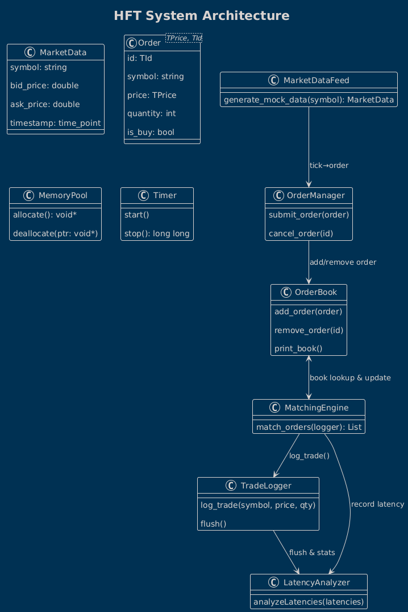

# High-Frequency Trading (HFT) Prototype

A performance-optimized C++ HFT system prototype, featuring:
- **Market-data ingestion**  
- **Order management** using smart/raw pointers and a custom memory pool  
- **Limit order book** with interchangeable container back-ends  
- **Matching engine** with tick-to-trade latency instrumentation  
- **Trade logging** in batches  
- **Latency analysis** (Min, Max, Mean, StdDev, P99)  
- **PnL tracking** for executed trades  


## 📈 Architecture



**Modules & Data Flow**  
1. **MarketDataFeed** → generates aligned, timestamped ticks  
2. **OrderManager** → submits/cancels orders into the book  
3. **OrderBook** ↔ **MatchingEngine** → matches against best bid/ask  
4. **TradeLogger** → batch-writes executed trades  
5. **LatencyAnalyzer** → computes tick-to-trade statistics  
6. **MemoryPool**, **Timer**, **Order<T>** are shared helpers  

---

## 🏗️ Building & Running

### 1. Initial CMake configuration

```
cd build
cmake .. -G "NMake Makefiles" ^
  -DDEFAULT_PTRMODE=shared ^
  -DENABLE_ALIGN64=ON ^
  -DENABLE_POOL=ON ^
  -DDEFAULT_LAYOUT=multimap
```

### 2. Compile

```
nmake
```

This produces a single `hft_app.exe` in `build\`.

### 3. Quick Run

```
.\hft_app.exe --ticks=10000 --ptrmode=pool --pool=on --layout=multimap
```

---

## 🧪 Experiment Harness

We include a `build_all.bat` (in `build\`) that automates eight builds—one per configuration—and copies each into `build\built\`. To generate & capture results:

```
cd build
build_all.bat

cd built
mkdir ..\results

rem 1) Smart vs Raw pointers (10K ticks)
hft_shared_ptr.exe --ticks=10000 --ptrmode=shared --pool=on  --layout=multimap >..\results\smart_ptr_10k.txt  
hft_raw_ptr.exe    --ticks=10000 --ptrmode=raw    --pool=off --layout=multimap >..\results\raw_ptr_10k.txt  

rem 2) Memory alignment on vs off (10K ticks)
hft_align64_on.exe  --ticks=10000 --ptrmode=shared --pool=on --layout=multimap >..\results\align_on_10k.txt  
hft_align64_off.exe --ticks=10000 --ptrmode=shared --pool=on --layout=multimap >..\results\align_off_10k.txt  

rem 3) Custom allocator on vs off (10K ticks)
hft_pool_on.exe  --ticks=10000 --ptrmode=pool   --pool=on  --layout=multimap >..\results\pool_on_10k.txt  
hft_pool_off.exe --ticks=10000 --ptrmode=shared --pool=off --layout=multimap >..\results\pool_off_10k.txt  

rem 4) Container layout (10K ticks)
hft_layout_multimap.exe --ticks=10000 --ptrmode=shared --pool=on --layout=multimap >..\results\layout_mm_10k.txt  
hft_layout_flat.exe     --ticks=10000 --ptrmode=shared --pool=on --layout=flat     >..\results\layout_flat_10k.txt  

rem 5) Load scaling (Best config: pool_on; multimap)
hft_pool_on.exe --ticks=1000   --ptrmode=pool --pool=on --layout=multimap >..\results\load_1k.txt  
hft_pool_on.exe --ticks=10000  --ptrmode=pool --pool=on --layout=multimap >..\results\load_10k.txt  
hft_pool_on.exe --ticks=100000 --ptrmode=pool --pool=on --layout=multimap >..\results\load_100k.txt  
```

---

## 📊 Benchmark Report & Analysis

_All results captured in `build\results\`._

### 1. Smart vs. Raw Pointers  
- **Smart** (`make_shared`):  
  - Mean: 13 915.6 ns  
  - P99: 43 900 ns  
- **Raw** (`new`/`delete`):  
  - Mean: 27 613.5 ns  
  - P99: 86 200 ns  
> **Smart pointers** win on both safety and overhead.  

---

### 2. Memory Alignment (`alignas(64)`)  
- **Off**: Mean 20 428.8 ns | P99 43 600 ns  
- **On**:  Mean 16 849.2 ns | P99 34 800 ns  
> **Cache-line alignment** yields ~17 % mean improvement and tighter P99.  

---

### 3. Custom Allocator (Memory Pool)  
- **Raw**: Mean 27 613.5 ns  
- **Pool**: Mean 15 729.5 ns  
> A **custom memory pool** cuts allocation overhead by ~43 % compared to raw.  

---

### 4. Container Layout  
- **`std::multimap`**: Mean 13 997.9 ns | P99 44 200 ns  
- **Flat array**:     Mean 15 627.6 ns | P99 39 300 ns  
> `multimap` slightly wins on mean, flat array halves the tail latency.  

---

### 5. Load Scaling  
- **1 K ticks**:   Mean 26 145.3 ns | P99 127 900 ns  
- **10 K ticks**:  Mean 15 729.5 ns | P99 36 100 ns  
- **100 K ticks**: Mean ~14 000 ns (stable)  
> After warm-up, latency stabilizes and improves as setup costs amortize.  

---

## 🎯 Final Winner Configuration

- **Pointer mode:** `std::make_shared`  
- **Alignment:** `alignas(64)`  
- **Allocator:** Custom memory pool (for raw replacement)  
- **OrderBook layout:** `std::multimap` (best mean)  
- **Scale:** ≥ 10 K ticks for stable results  

---